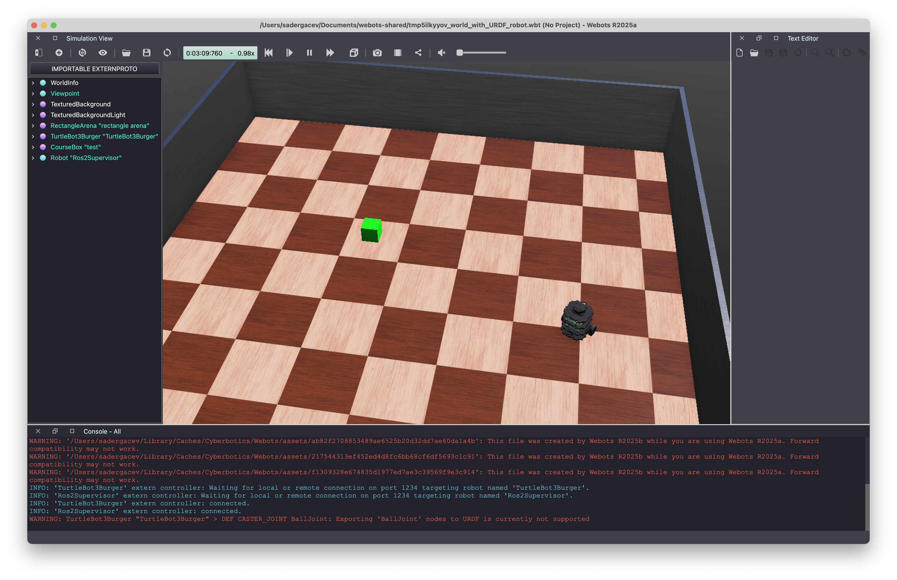

# Проектный семинар «Мобильные колесные роботы»

Репозиторий курса «Мобильные колесные роботы» для программы ПИРС факультета компьютерных наук НИУ ВШЭ.

Репозиторий содержит рабочую среду и все необходимые файлы для ее воспроизведения. По ходу курса в репозитории будут появляться задания для практических работ, презентации и примеры с занятий для самостоятельного запуска.

Среда построена на основе **Ubuntu 24.04** и **ROS2 Jazzy** и запускается в Docker.

Рабочая среда и инструкция будут обновляться и дополняться.

## Структура репозитория

```text
.
├── docker/Dockerfile              # Образ рабочей среды
├── docker-compose.yaml            # Основная конфигурация контейнера
├── docker-compose.gpu.yaml        # Доступ к GPU через /dev/dri
├── docker-compose.nvidia.yaml     # Доступ к NVIDIA GPU
├── docker-compose.webots-mac.yaml # Связь с Webots на macOS из Linux VM
├── docker-compose.webots-linux.yaml # Запуск Webots из контейнера на Linux
├── .env                           # Общие настройки среды
├── .env.local                     # Локальные настройки (необходимо создать самостоятельно)
├── doc/                           # Дополнительные инструкции, в том числе для UTM на macOS
├── examples/                      # ROS 2 пакеты с примерами (будут добавляться)
├── practices/                     # Задания по практикам (будут добавляться)
└── presentations/                 # Презентации занятий (будут добавляться)
```


## Подготовка к работе

В рамках учебного курса предполагается, что выполнение работ осуществляется на ПК с установленной операционной системой Linux с графическим рабочим столом (предпочтительная Ubuntu 24.04, однако могут использоваться и другие дистрибутивы). При использовании компьютеров на базе macOS сначала потребуется установка виртуальной машины с Linux с использованием UTM (см. [инструкцию](doc/utm_macos.md)).


### Установка Docker

Для работы с репозиторием потребуется установленный `git` и `Docker Engine` с `Docker Compose`. Установите Docker по [[официальной инструкции для Ubuntu]](https://docs.docker.com/engine/install/ubuntu/) и настройте [[доступ для своего пользователя]](https://docs.docker.com/engine/install/linux-postinstall/).


### Подготовка окружения

Клонируйте репозиторий:

```bash
git clone https://github.com/PathPlanning/2026-Project-Seminar-Mobile-Wheeled-Robots mobile-robots-project-seminar
cd mobile-robots-project-seminar
```

Создайте и заполните файл с переменными среды `.env.local` следующей командой.

```bash
cat << EOF > .env.local
USERNAME=$(whoami)
USER_ID=$(id -u)
GROUP_ID=$(id -g)
DISPLAY=$DISPLAY
ROS_DOMAIN_ID=30
VIDEO_GID=$(getent group video | cut -d: -f3)
RENDER_GID=$(getent group render | cut -d: -f3)
EOF
```
Учтите, что файл `.env.local` исключен из Git. Если файл уже существует, команда перезапишет его: при повторной настройке можно отредактировать только нужные значения.

Все команды `docker compose` выполняются из корня репозитория на Linux-хосте (при использовании UTM — в Ubuntu внутри виртуальной машины). Оба файла передаются через `--env-file`, чтобы Compose использовал их значения при подстановке переменных в конфигурацию.

### GUI в Docker

Cамый простой способ запуска GUI приложений внутри Docker это использование X11. Большинство Linux-систем в прошлом использовали графический сервер X11 (XOrg). Архитектура X11 изначально построена по принципу «клиент-сервер», где приложение — это клиент, а экран и клавиатура — это сервер. Сейчас альтернативу X11 составляет Wayland, при этом запуск X11 приложений в Wayland возможен через XWayland.

Что для этого нужно:

* **Переменная окружения `DISPLAY`**: Контейнеру передается переменная, которая указывает, куда отправлять графические команды (обычно :0).
* **Монтирование UNIX-сокета**: Контейнеру открывают доступ к сокету X-сервера хоста, который находится по пути `/tmp/.X11-unix`.
* **Авторизация**: Хост должен разрешить контейнеру подключение. Есть несколько способов авторизации, мы будем использовать ключ авторизации `XAUTHORITY`, передаваемый внутрь контейнера. Для этого перед запуском контейнера будет необходимо установить переменную `HOST_XAUTHORITY="$XAUTHORITY"`

Если переменная `XAUTHORITY` не задана, проверьте стандартный путь к файлу авторизации:

```bash
export XAUTHORITY="${XAUTHORITY:-$HOME/.Xauthority}"
test -f "$XAUTHORITY" && printf 'XAUTHORITY=%s\n' "$XAUTHORITY"
```

Если файл не найден, укажите в `XAUTHORITY` путь к файлу авторизации текущей графической сессии. В `.env` уже настроен путь внутри контейнера, его менять не требуется.

> [!IMPORTANT]
> Мы уже добавили переменную `DISPLAY` в файл `.env.local`, однако после нового входа в графическую сессию `DISPLAY` может измениться (хотя это случается редко). При необходимости обновите значение в файле и внутри контейнера (если нет возможности пересоздать контейнер).

> [!IMPORTANT]
> Если ваша система использует Wayland, то ключ `XAUTHORITY` меняется после нового входа в графическую сессию, таким образом его требуется заново устанавливать перед запуском docker контейнера.

> [!IMPORTANT]
> При обычном подключении по SSH значения `DISPLAY` и `XAUTHORITY` графической сессии хоста могут быть недоступны. Их необходимо посмотреть в этой сессии и установить вручную. Окна будут открываться на рабочем столе хоста.

### Аппаратное ускорение графики

Для доступа к графическому ускорению используются дополнительные файлы Docker Compose:

* `docker-compose.gpu.yaml` — передает в контейнер устройства `/dev/dri` и добавляет пользователя в группы `video` и `render`. Обычно используется для Intel и AMD с драйверами Mesa. Для этого варианта на хосте должны существовать `/dev/dri`, а `VIDEO_GID` и `RENDER_GID` в `.env.local` должны содержать числовые идентификаторы групп.
* `docker-compose.nvidia.yaml` — передает NVIDIA GPU через NVIDIA Container Toolkit. На хосте должны быть установлены драйвер NVIDIA и [[NVIDIA Container Toolkit]](https://docs.nvidia.com/datacenter/cloud-native/container-toolkit/latest/install-guide.html) с настройкой для Docker.

В командах ниже уже по умолчанию используется `docker-compose.gpu.yaml`. Если вы используете NVIDIA, дополните команду файлом `docker-compose.nvidia.yaml`. Используйте один и тот же набор файлов при сборке, запуске и остановке среды.

## Сборка среды


### Сборка базовой среды с ROS2
Сборка образа осуществляется командой:
```bash
HOST_XAUTHORITY="$XAUTHORITY" docker compose --env-file .env --env-file .env.local -f docker-compose.yaml -f docker-compose.gpu.yaml [-f docker-compose.nvidia.yaml] build

```
Первая сборка скачивает ROS 2 и много зависимостей, поэтому может занять значительное время. Во время сборки образа примеры автоматически собираются через `colcon`.

### Сборка среды с ROS2 и Webots

**Linux**

Для установки Webots внутрь контейнера добавьте файл `docker-compose.webots-linux.yaml` во время сборки образа:

```bash
HOST_XAUTHORITY="$XAUTHORITY" docker compose --env-file .env --env-file .env.local -f docker-compose.yaml -f docker-compose.gpu.yaml -f docker-compose.webots-linux.yaml [-f docker-compose.nvidia.yaml] build
```

> [!IMPORTANT]
> Этот вариант сборки поддерживает только архитектуру `amd64`.

> [!IMPORTANT]
> Квадратные скобки в командах обозначают необязательный аргумент. Для NVIDIA подставьте `-f docker-compose.nvidia.yaml` без скобок, в остальных случаях удалите весь фрагмент в скобках.

**macOS**

На Mac среда с ROS2 запускается в Docker внутри Ubuntu в UTM, а Webots устанавливается непосредственно в macOS. Установите [Webots R2025a](https://github.com/cyberbotics/webots/releases/tag/R2025a) в `/Applications/Webots.app` и настройте общую папку по [инструкции](doc/webots_macos_shared_folder.md), включая переменные в `.env.local`.

В Ubuntu внутри виртуальной машины выполните:

```bash
HOST_XAUTHORITY="$XAUTHORITY" docker compose --env-file .env --env-file .env.local -f docker-compose.yaml -f docker-compose.gpu.yaml -f docker-compose.webots-mac.yaml build
```

Файл `docker-compose.webots-linux.yaml` для этого варианта не используется и не должен быть включен при сборке. Его включение может привести к ошибке сборки.


## Запуск среды

### Запуск базовой среды с ROS2

Для запуска контейнера выполните команду:

```bash
HOST_XAUTHORITY="$XAUTHORITY" docker compose --env-file .env --env-file .env.local -f docker-compose.yaml -f docker-compose.gpu.yaml [-f docker-compose.nvidia.yaml] up -d
```

Контейнер сервиса `ros2-base` остается запущенным с командой `sleep infinity`. Для работы в контейнере запустите в нем `zsh` следующей командой (или используйте VS Code для разработки внутри контейнера [[инструкция]](https://code.visualstudio.com/docs/devcontainers/attach-container)):

```bash
HOST_XAUTHORITY="$XAUTHORITY" docker compose --env-file .env --env-file .env.local -f docker-compose.yaml -f docker-compose.gpu.yaml [-f docker-compose.nvidia.yaml] exec -it ros2-base zsh
```


В `zsh` окружение ROS2 и собранных примеров подключается автоматически. Для каждого дополнительного терминала повторите команду `exec`. Команда `exit` закрывает оболочку, но оставляет контейнер работающим.

### Запуск среды с ROS2 и Webots


**Linux**

Для запуска контейнера с установленным Webots выполните:

```bash
HOST_XAUTHORITY="$XAUTHORITY" docker compose --env-file .env --env-file .env.local -f docker-compose.yaml -f docker-compose.gpu.yaml -f docker-compose.webots-linux.yaml [-f docker-compose.nvidia.yaml] up -d

HOST_XAUTHORITY="$XAUTHORITY" docker compose --env-file .env --env-file .env.local -f docker-compose.yaml -f docker-compose.gpu.yaml -f docker-compose.webots-linux.yaml [-f docker-compose.nvidia.yaml] exec -it ros2-base zsh
```

> [!IMPORTANT]
> Квадратные скобки в командах обозначают необязательный аргумент. Для NVIDIA подставьте `-f docker-compose.nvidia.yaml` без скобок, в остальных случаях удалите весь фрагмент в скобках.

**macOS**

Перед запуском контейнера проверьте, что общая папка смонтирована в Ubuntu и доступна для записи (см. [инструкцию](doc/webots_macos_shared_folder.md)).

На **macOS** скачайте [скрипт-сервер запуска Webots](https://github.com/cyberbotics/webots-server/blob/main/local_simulation_server.py) и запустите его в терминале:

```bash
export WEBOTS_HOME=/Applications/Webots.app
python3 local_simulation_server.py
```

Для этой команды требуется установленный Python 3. Оставьте терминал открытым: сервер ожидает подключения на порту `2000` и запускает Webots по запросу из контейнера.

В терминале **Ubuntu внутри UTM**, из корня репозитория, выполните:

```bash
HOST_XAUTHORITY="$XAUTHORITY" docker compose --env-file .env --env-file .env.local -f docker-compose.yaml -f docker-compose.gpu.yaml -f docker-compose.webots-mac.yaml up -d

HOST_XAUTHORITY="$XAUTHORITY" docker compose --env-file .env --env-file .env.local -f docker-compose.yaml -f docker-compose.gpu.yaml -f docker-compose.webots-mac.yaml exec -it ros2-base zsh
```

Контейнер получает переменную `WEBOTS_SHARED_FOLDER` и IP-адрес Mac из `docker-compose.webots-mac.yaml`. Если соединение не устанавливается, проверьте `MAC_HOST_IP` в `.env.local` и доступность портов `2000` (сервер запуска) и `1234` (контроллеры Webots) с виртуальной машины.

В обоих вариантах окно Webots открывается при запуске примера из раздела ниже. Для каждого дополнительного терминала повторите соответствующую команду `exec`. При остановке, повторном запуске и удалении контейнера используйте тот же набор файлов Compose, что и при сборке и запуске.


### Изменение кода

Исходники подключены с хоста в контейнер:

| Каталог репозитория | Каталог в контейнере |
| --- | --- |
| `examples/` | `~/examples_ws/src/` |
| `practices/` | `~/practices_ws/src/` |

Вы можете редактировать их привычным редактором на Linux-хосте, либо внутри контейнера и изменения будут синхронизированы.


### Остановка и удаление контейнера

На Linux-хосте:

```bash
# Остановить контейнер
HOST_XAUTHORITY="$XAUTHORITY" docker compose --env-file .env --env-file .env.local -f docker-compose.yaml -f docker-compose.gpu.yaml [-f docker-compose.nvidia.yaml -f docker-compose.webots-mac.yaml -f docker-compose.webots-linux.yaml] stop

# Запустить остановленный контейнер
HOST_XAUTHORITY="$XAUTHORITY" docker compose --env-file .env --env-file .env.local -f docker-compose.yaml -f docker-compose.gpu.yaml [-f docker-compose.nvidia.yaml -f docker-compose.webots-mac.yaml -f docker-compose.webots-linux.yaml] start

# Остановить и удалить контейнер
HOST_XAUTHORITY="$XAUTHORITY" docker compose --env-file .env --env-file .env.local -f docker-compose.yaml -f docker-compose.gpu.yaml [-f docker-compose.nvidia.yaml -f docker-compose.webots-mac.yaml -f docker-compose.webots-linux.yaml] down
```


## Запуск и сборка примеров в Docker

Все команды этого раздела выполняются внутри контейнера в `zsh`. Примеры уже собраны при сборке образа. После изменения исходников или добавления новых пакетов пересоберите рабочее пространство:

```bash
cd ~/examples_ws
colcon build --symlink-install
source install/setup.zsh
```

Для практических работ используйте аналогичные команды в `~/practices_ws`, когда в нем появятся пакеты. Если при открытии `zsh` выводится сообщение об отсутствии `practices_ws/install/local_setup.zsh`, это означает, что рабочее пространство практик еще не собрано, запуску примеров это не мешает.

Исходники сохраняются на хосте, а результаты сборки (`build`, `install`, `log`) и установленные вручную зависимости находятся в контейнере. После удаления или пересоздания контейнера они теряются. После `down` среду можно создать заново командой `up -d` из раздела запуска, примеры будут в состоянии, сохраненном в образе.

Для остановки запущенного примера используйте `Ctrl+C`.

### Talker и Listener

Пример обмена строковыми сообщениями через топик `/topic`.

В одном терминале контейнера запустите:

```bash
ros2 run example_listener_talker talker
```

Во втором:

```bash
ros2 run example_listener_talker listener
```

`talker` публикует `Hello World: …`, а `listener` выводит полученные сообщения. Для просмотра топика можно открыть третий терминал и выполнить `ros2 topic echo /topic`.

### Пример с Turtlesim: 1

```bash
ros2 launch example_turtlesim sin_maker.launch.py
```

Launch-файл открывает симулятор, создает `turtle2` и запускает управление с постоянной линейной скоростью и угловой скоростью, меняющейся по синусоиде.

### Пример с Turtlesim: 2

Завершите предыдущий пример через `Ctrl+C`, затем запустите:

```bash
ros2 launch example_turtlesim nav2goal.launch.py
```

Черепашка `turtle2` движется из начальной позиции к точке `(2, 8)`.

Запускайте эти два launch-файла по очереди: они используют одинаковые имена узлов, сервисов и топиков.


### Пример с Turtlebot3 в Webots

На Linux откройте терминал контейнера. На Mac сначала запустите сервер Webots в macOS, затем откройте терминал контейнера, как описано выше.

Внутри контейнера запустите пример из репозитория:

```bash
ros2 launch example_webots spawn_robot.launch.py
```

Launch-файл открывает мир `my_world.wbt` с роботом TurtleBot3 Burger и препятствием, запускает драйвер робота и контроллеры колес. На Linux окно симулятора открывается на рабочем столе Linux-хоста, на Mac — в macOS.

Дождитесь загрузки мира и запуска контроллеров. Во втором терминале контейнера выполните:

```bash
ros2 topic pub -r 10 /cmd_vel geometry_msgs/msg/TwistStamped "{header: {stamp: {sec: 0, nanosec: 0}, frame_id: 'base_link'}, twist: {linear: {x: 0.1, y: 0.0, z: 0.0}, angular: {x: 0.0, y: 0.0, z: 0.2}}}"
```

Команда публикует команду скорости для робота с частотой 10 Гц: робот должен начать двигаться с линейной скоростью `0.1` м/с и угловой скоростью `0.2` рад/с. 

Пример окна с запущенным миром и роботом:



Предупреждения о несоответствии версий и дургие Warning можно игнорировать.

Чтобы остановить публикацию, нажмите `Ctrl+C` во втором терминале.

Для завершения примера нажмите `Ctrl+C` в терминале с launch-файлом. На Mac сервер запуска остается ожидать следующий запуск; его можно остановить через `Ctrl+C` в терминале macOS.
